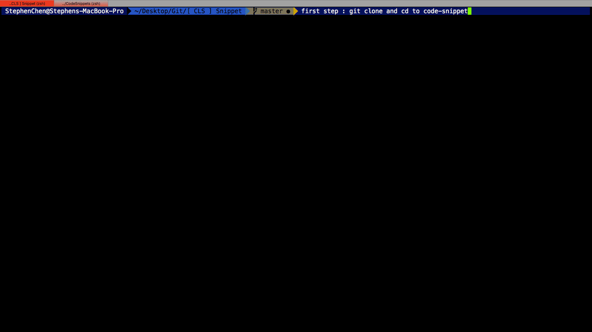

#Code Snippet
===============================

**Code-Snippet** is a place everybody can share their own personal code snippet with one another

##Usage

#### Atom developer
-----------------------------------
run below commands when pull **everytime** ,  this will update the code-snippet in **~/.atom/snippets.cson***
```bash
# In mac terminal
sh update.sh atom
```

#### Xcode developer
-----------------------------------
run below commands when pull **everytime** ,  this will update the code-snippet in **~/Library/Developer/Xcode/UserData/CodeSnippets/***
```bash
# In mac terminal
sh update.sh xcode
```

##Contributor
-----------------------------------
contributor mush follow the snippet-rules made by us , if you want be part of us , feel free to contact us

##Contributor Usage
----------------------------------
contributor will create new/delete snippets , after **finish** , run below command

```bash
# In mac terminal
sh push.sh commit-message
```

##Gif demo


