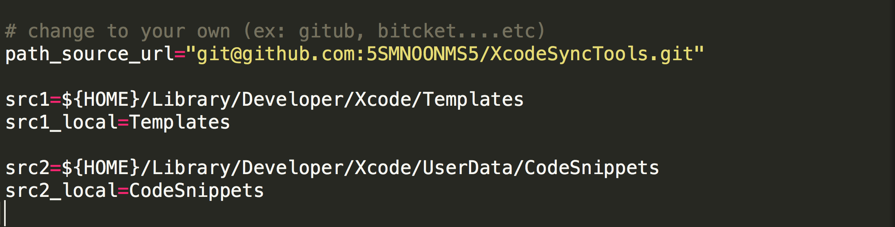
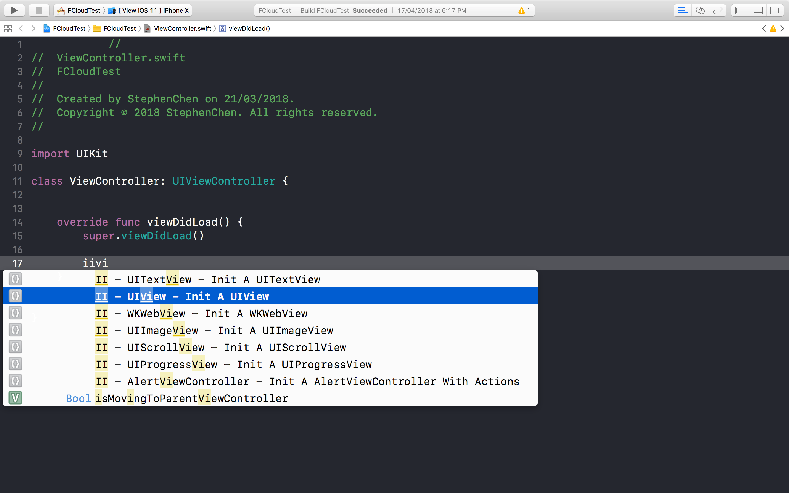
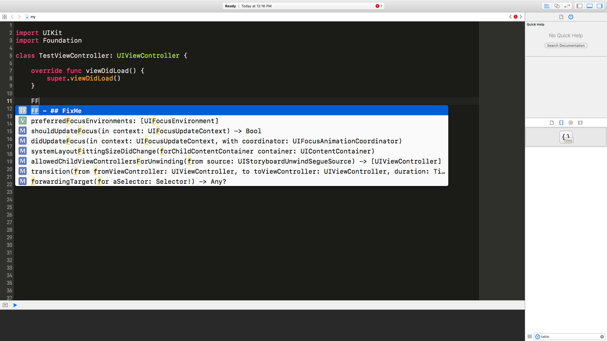
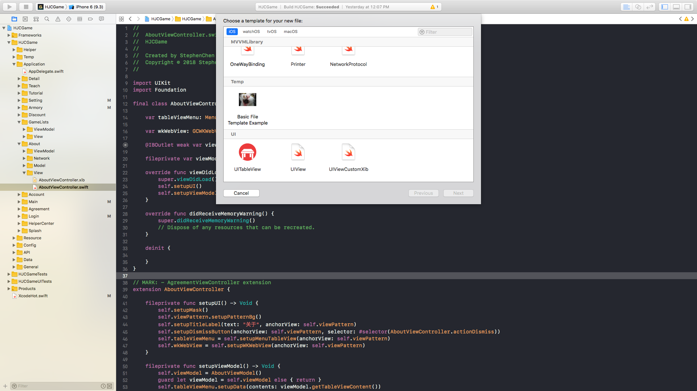

# XcodeSyncTools

[A English version of this document can be found here](https://github.com/5SMNOONMS5/XcodeSyncTools/blob/master/README_EN.md)

同步 Xcode 在不同電腦裡內建的 **Code-Snippets (程式碼片段)** 還有 **File-Template (檔案模板)**。
 
## 什麼是 Code-Snippets 跟 File-Template？

* [如何製作 Code-Snippets (圖文教學)](Tutorials/README_CS_CN.md)

### Code-Snippets


* 根據自定義關鍵字，返回一段預先寫好的 Snippet。

### File-Template

* [如何製作 File-Template (圖文教學)](Tutorials/README_T_CN.md)


* 跟 Code-Snippets 的概念是一樣的，但可以依照預先創建好 資料夾結構。

## 專案流程


* Git clone 之後到本機的 XcodeSyncTools 目錄底下，然後執行腳本會將 XcodeSyncTools 目錄底下的檔案 copy 一份到 /Users/<YourName>/Library/Developer/Xcode 底下 (以下簡稱 Xcode 目錄底下)，那 **假如** 有在終端機上面執行 [fsevents-tools](https://github.com/ggreer/fsevents-tools) 的話，就會開始**監聽** 
Xcode 目錄底下的檔案變化，然後同步回去 XcodeSyncTools 目錄底下。

* 其實最主要還是透過 git 去管理，但在這邊想分享的是 [fsevents-tools](https://github.com/ggreer/fsevents-tools) 。 fsevents-tools 利用 OS X's [FSEvents](https://en.wikipedia.org/wiki/FSEvents) API 來監聽檔案或者目錄的變化，
只要發生任何變化 (新增，刪除，修改) 就會 **接 (pipe)** 著執行 [rsync](https://zh.wikipedia.org/wiki/Rsync) ，將 Xcode 目錄底下的 File-Template 還有 Code-Snippets 同步到 XcodeSyncTools 底下的資料夾，這樣每當開發者在 Xcode 裡面修正樣板程式碼的時候，XcodeSyncTools 專案底下的檔案也會隨著一起變動。然後再透過 git 來達到同步的效果，你可以把 fsevents-tools 想成是 OS X 版本的 [inotify](https://zh.wikipedia.org/wiki/Inotify)。

## 如果不用這專案會怎樣嗎?

* 完全不會怎樣，因為大部分的開發者在修正 File-Template 或者 Code-Snippets 時都會在 Xcode 中去製作 (詳情可以看教學部分 [Code-Snippets](Tutorials/README_CS_CN.md) ， [File-Template](Tutorials/README_T_CN.md))，那當製作完了通常會需要在**手動**去同步，那如果使用 [fsevents-tools](https://github.com/ggreer/fsevents-tools) 的話則可以省去這個步驟。

> 您也可以將 pipe 之後接成任意腳本去執行。(ex: 執行 githook 或者 git push)

## 如何開始

* 把專案 clone 下來。
* 執行腳本，會將 CodeSnippets 跟 Templates 資料夾底下的檔案複製一份到 Xcode 的 CodeSnippets 跟 Templates 底下。(如果已經有舊的，那會把舊的複製一份保存下來)

* 註：不要直接載下來，因為我是用 [git Submodule](https://git-scm.com/book/en/v2/Git-Tools-Submodule) 的方式把 [fsevents-tools](https://github.com/ggreer/fsevents-tools) 加進這專案裡面。

```bash
# 第 1 步: clone 
# 透過 Http
git clone --depth 1 https://github.com/5SMNOONMS5/XcodeSyncTools.git

# 第 2 步: 移動工作目錄到 XcodeSyncTools 底下
cd XcodeSyncTools

# 第 3 步: 同步所有檔案，**只有第一次需要使用**，之後請用 -w 來監聽即可
sh xcode-sync.sh -s

# 第 4 步: 打開 Xcode ， 開始享用：）
```

## 更多

```bash
sh xcode-sync.sh -h
``` 

## 監聽 

```bash
sh xcode-sync.sh -w
``` 

## 擁有自己的 Code-Snippets 及 File-Template

這專案的 Code-Snippets 跟 File-Template 都大多數都偏向個人使用, 但如果想使用自己的 repo 可以修正在 xcode-sync.sh 裡面的 path_source_url 變數



修正後，記得 run 

```bash
sh xcode-sync.sh -c
``` 

接著就一連串的 add commit push 迴圈，開啟專屬您的 Code-Snippets 以及 File-Template。

## Code-Snippets 使用關鍵字

### II

Type **II** ( 大部分物件的初始化 )



### FF

Type **FF** ( 客製的 swift flag ）



### MM

Type **MM** ( Mark ）


### VV

按下 **VV** ( View 的生命週期 ）


## File-Template 使用方式

打開 Xcode，並且像往常那樣新增檔案 File -> New -> File，滑到最下面就會發現惹




