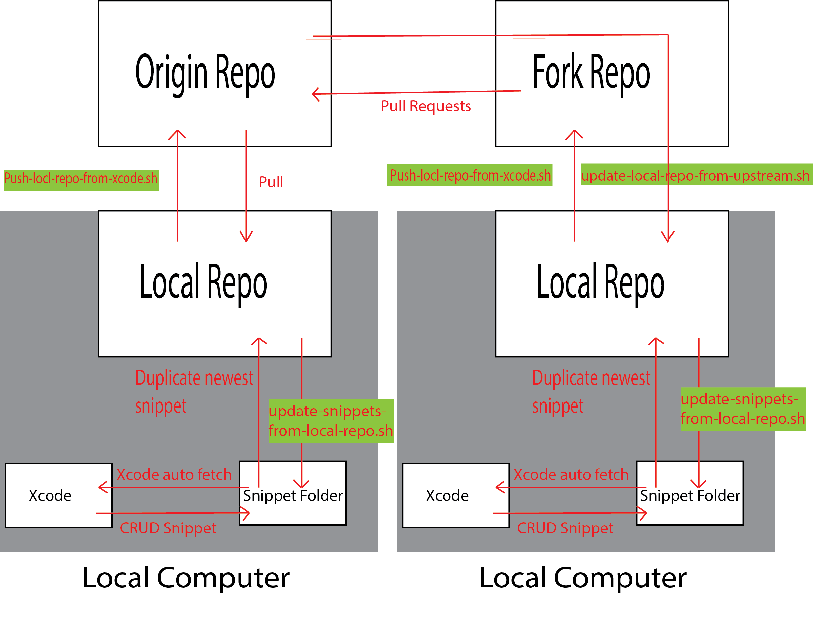

#Code Snippet
===============================

**Code-Snippet** is a place everybody can share their own personal code snippet with one another

##User Quick Starts

#### Atom (not support)
-----------------------------------
* run commands while **each pull**, this will update the newest snippets into **~/.atom/snippets.cson***
```bash
# "Without" Fork Repositories
sh update-snippets-from-local-repo.sh atom

# "With" Fork Repositories
sh update-local-repo-from-upstream.sh
sh update-snippets-from-local-repo.sh atom
```

#### Xcode
-----------------------------------
* run commands while **each pull**, this will update the newest snippets into **~/Library/Developer/Xcode/UserData/CodeSnippets**
```bash
# "Without" Fork Repositories
sh update-snippets-from-local-repo.sh xcode

# "With" Fork Repositories
sh update-local-repo-from-upstream.sh
sh update-snippets-from-local-repo.sh xcode
```


##Flow


