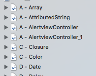
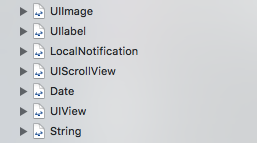
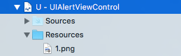
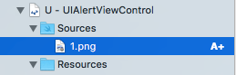

Swift Code Snippet Share
===============================

**Swift-Code-Snippet** is a place everybody can share their own personal code snippet with one another 

Using playground is because swift update very often , let playground check of the code with the swift lastest version

Screen Shots :
------------

Code Style : 
------------
please following office style written by Ray Wenderlich (https://github.com/raywenderlich/swift-style-guide)

Pull Request Style :
------------

*  Pages Naming Style，Please arranged alphabetically of the first letter of class

**Preferred:**

**Not Preferred:**

*  Pictures are require put under the **Resource** folder of current class pages 

**Preferred:**

**Not Preferred:**

*Code Explanations are located in the top of the code 

**Preferred:**

**Not Preferred:**

