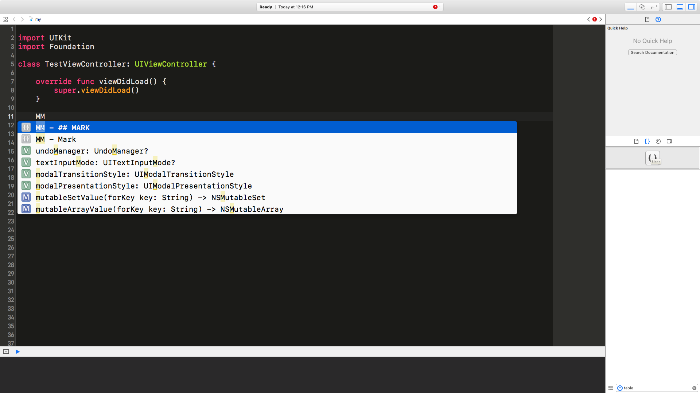

#Code Snippet
===============================

My personal code-snippet sync tool, store in one place, using everywhere.

## User Quick Starts

### Atom (not support)
* run commands while **each pull**, this will update the newest snippets into **~/.atom/snippets.cson***

```bash
# "Without" Fork Repositories

sh update-snippets-from-local-repo.sh atom

# "With" Fork Repositories

sh update-local-repo-from-upstream.sh
sh update-snippets-from-local-repo.sh atom
```

### Xcode
* run commands while **each pull**, this will update the newest snippets into **~/Library/Developer/Xcode/UserData/CodeSnippets**

```bash
# "Without" Fork Repositories

sh update-snippets-from-local-repo.sh xcode

# "With" Fork Repositories

sh update-local-repo-from-upstream.sh
sh update-snippets-from-local-repo.sh xcode
```

## Flow


## Personal Keyword

### II

Type **II** for initialization


### DD

Type **DD** for Delegate And Datasource


### FF

Type **FF** for FIXME


### MM

Type **MM** for Mark



### VV

Type **VV** for View Life Cycle


