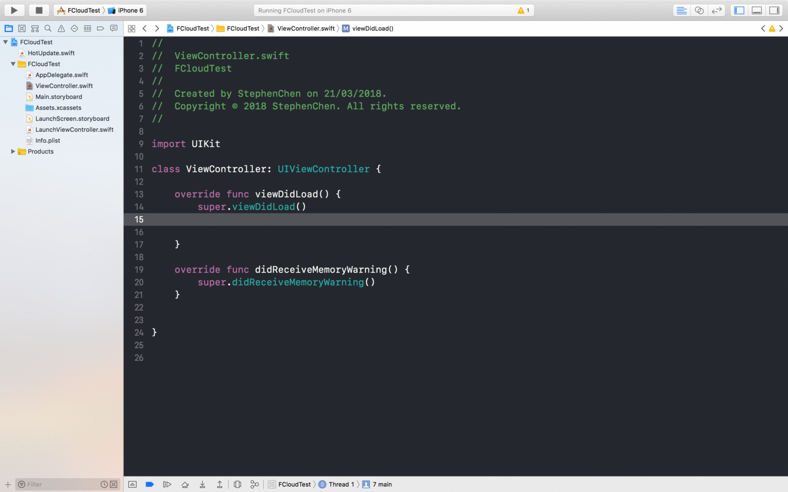
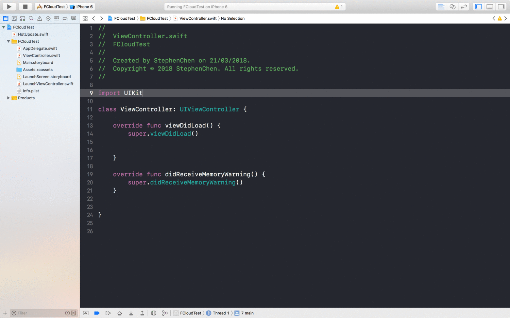
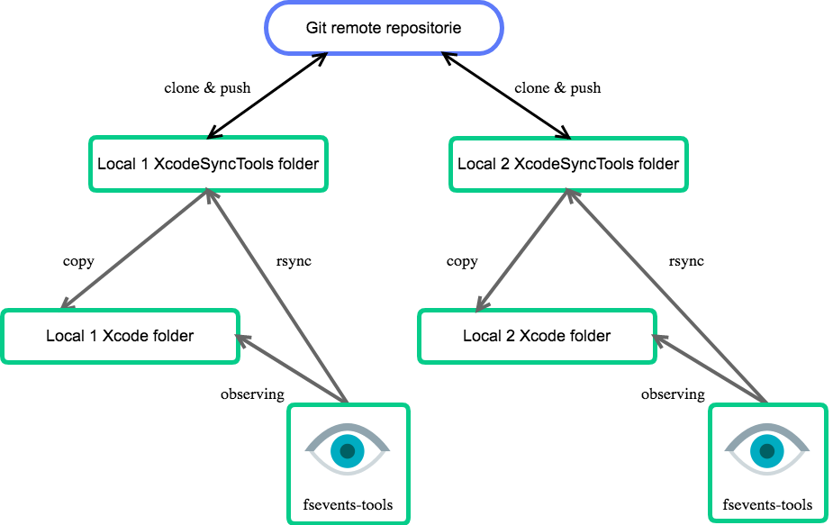

# XcodeSyncTools （Not done yet)

[中文版 README](https://github.com/5SMNOONMS5/XcodeSyncTools/blob/master/README.md)

My personal xcode **code-snippets** and **file-template** sync tool.

## What is code-snippet and file-template in Xcode??

### code-snippet



Place your customize keyword and your buildin snippets will popup for you, it save times for you.

### file-templates



Like code-snippet, but additional it creates folders, files and xibs for you.

## What is this project do??

Sync multiply code-snippet and file-template within different computers.

## Core concept



It very easy to understand via the above diagram, but here I want to share about [fsevents-tools](https://github.com/ggreer/fsevents-tools), [fsevents-tools](https://github.com/ggreer/fsevents-tools) uses [FSEvents](https://developer.apple.com/library/content/documentation/Darwin/Conceptual/FSEvents_ProgGuide/Introduction/Introduction.html)[wiki](https://en.wikipedia.org/wiki/FSEvents) that allows you to observer the changes in given directory then hook your own script. For my case, I use fsevents-tools to listen to the folders **CodeSnippets** and **Templates**, while developer delete, create or modify any files, it then run [rsync](https://zh.wikipedia.org/wiki/Rsync) to sync between the folders under this project and xcode.

## Quick Start

```bash
# Step 1: Clone first 

# SSH 
git clone git@github.com:5SMNOONMS5/XcodeSyncTools.git 

# Http
git clone https://github.com/5SMNOONMS5/XcodeSyncTools.git

# Step 2: Change working directory
cd XcodeSyncTools

# Step 3: Run startup script
sh xcode-sync.sh -s
```

Don't download it directory, because I embeded [fsevents-tools](https://github.com/ggreer/fsevents-tools) via [git Submodule](https://git-scm.com/book/en/v2/Git-Tools-Submodule)

## More details

```bash
sh xcode-sync.sh -h
``` 

## Keyword

### II

Type **II** for initialization


### FF

Type **FF** for FIXME


### MM

Type **MM** for Mark


### VV

Type **VV** for View Life Cycle


